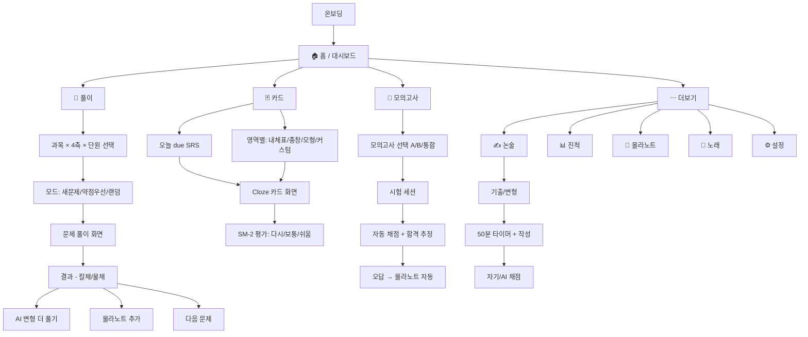
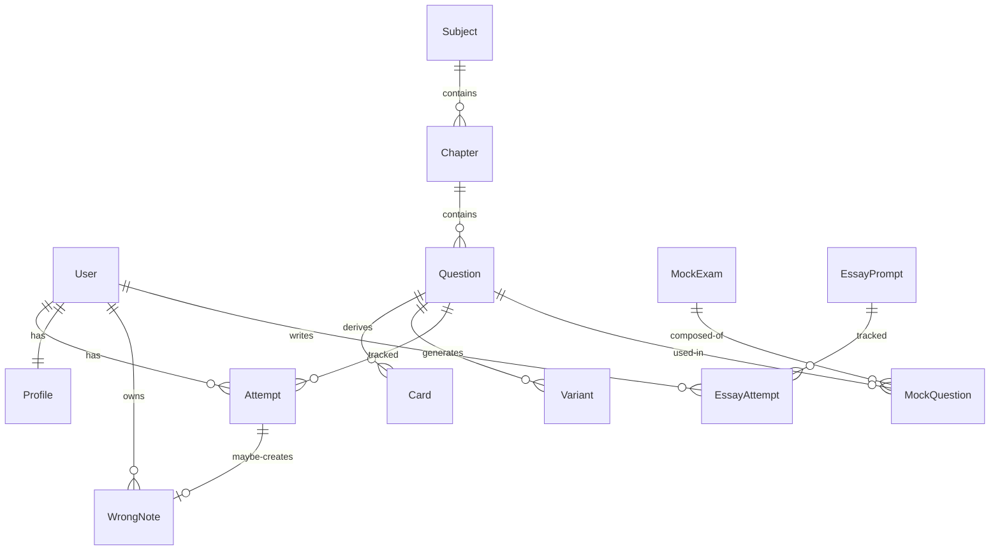

# 임고닷컴 — 앱 전체 지도 (App Map v1)

> 작성일: 2026-05-28
> 기반: 합격 수기 36건 분석 (research/ 는 정리됨 — git 히스토리에서 복구 가능)
> 핵심 가치: **변형문제 대량 생성 + 문제풀이를 통한 능동 암기** (백구 인강 후 능동 인출 단계 자동화)

---

## 0. 한 줄 요약

```
[백구 인강 (외부)]
        ↓
[임고닷컴]
   ├── 4축×12과목 taxonomy로 정리된 기출·변형·카드
   ├── AI 변형문제 무제한 자동 생성
   ├── SRS·cloze·몰라노트·모의고사·논술 자동화
   └── 시기별 가이드 + 페르소나별 모드
        ↓
[1차 시험 합격 → 2차 → 최종]
```

**한 줄 카피:** "백구 듣고 까먹지 않게 해주는 앱"

---

## 1. 정보 구조 (IA) — 5탭 + 부가 모듈

### 1.1 메인 5탭 (모바일 우선, 데스크탑은 사이드)

```
┌─────────────────────────────────────────────────────┐
│  🏠 홈     📖 풀이    🃏 카드    📝 모의    ⋯ 더보기  │
└─────────────────────────────────────────────────────┘
```

| 탭 | 역할 | 우선순위 |
|---|---|---|
| 🏠 **홈** | 대시보드 — D-DAY·오늘 할 일·진척 미니·시기 가이드·빠른 진입 | 매일 첫 진입 |
| 📖 **풀이** | 변형문제 풀이 엔진 (핵심 가치 발현) | 매일 메인 |
| 🃏 **카드** | SRS·cloze·통암기 (내체표·총창·모형) | 매일 보조 |
| 📝 **모의고사** | 시간 제한 + 자동 채점 + 합격 추정 | 9~10월 폭증 |
| ⋯ **더보기** | 논술 · 진척 · 몰라노트 · 설정 | 주 1~2회 |

### 1.2 "더보기" 내부

```
더보기/
├── ✍️ 교직논술 (50분 타이머 + 자기/AI 채점)
├── 📊 진척 (4축 × 12과목 히트맵, 약점 Top, 추세)
├── 📒 몰라노트 (자동 수집된 약점·오답)
├── 🎵 노래 큐레이션 (내체표 노래 외부 유튜브)
├── ⚙️ 설정
│   ├── 페르소나 / 시험일 / 지역
│   ├── 채점 모드 (칼채 / 물채)
│   ├── 영역 on/off ("줄건 줘")
│   ├── AI 옵션 (BYOK Claude API)
│   ├── 백업 / 복원
│   └── 푸시 알림
└── ℹ️ About / 도움말
```

---

## 2. 화면 지도 (Sitemap)



---

## 3. 데이터 모델

### 3.1 핵심 엔티티



### 3.2 엔티티 상세

```yaml
User:
  id: uuid
  created_at, updated_at
  # Phase 1은 인증 없음 — UUID로 device-local

Profile:
  user_id: FK
  persona: enum  # 초수 | N수 | 재임용 | 직장병행 | 휴학
  exam_date: date
  region: enum   # 서울/경기/인천/부산/대구/광주/대전/충북/충남/전남/전북/경남/경북/강원/제주/세종
  daily_goal_minutes: int
  scoring_mode: enum  # 칼채 | 물채
  excluded_areas: array  # "줄건 줘" — 사용자가 제외한 {subject, axis, chapter}
  byok_anthropic_key: string  # 옵션, 브라우저 only

Subject:
  id: int
  code: enum  # 국|수|사|과|영|도|실|총창|체|음|미|통|교직논술
  type: enum  # A형 | B형 | 별도(논술/총창)
  points: int  # 11, 9, 7, 4, etc

Chapter:
  id: int
  subject_id: FK
  axis: enum  # 기본이론 | 각론 | 모형 | 교육과정문서
  axis_detail: enum  # 교육과정문서면 [성취기준/밑교/앞교/뒷교/내체표/신예표]
  name: string
  grade_range: array  # [1,2] / [3,4] / [5,6]
  weight: float  # 출제 빈도 가중치

Question:
  id: uuid
  chapter_id: FK
  source: enum  # 기출 | AI변형 | AI신규 | 모의고사
  source_meta: json  # 기출이면 {year, exam_round}
  stem: text  # 발문 + 제시문
  answer_keywords: array  # 칼채용 필수 키워드
  model_answer: text  # 모범답안
  difficulty: int 1-5
  tags: array  # ["수능형", "적용형", "단답형", "비벼쓰기"]
  needs_review: boolean  # AI 생성 시 검증 필요 표시

Card:
  id: uuid
  question_id: FK (nullable)  # 문제에서 파생된 카드
  content: text
  cloze_positions: array  # 빈칸 위치
  subject_id, chapter_id: FK
  srs:
    box: int  # Leitner 1~5
    due: timestamp
    ease: float  # SM-2
    reps: int
    lapses: int

Attempt:
  id: uuid
  user_id, question_id: FK
  user_answer: text
  result: enum  # correct | partial | wrong
  score: float 0-1
  matched_keywords: array
  duration_ms: int
  scoring_mode: enum  # 칼채/물채
  created_at: timestamp

WrongNote:
  id: uuid
  user_id: FK
  question_id: FK (nullable)
  card_id: FK (nullable)
  user_notes: text  # 자유 메모
  tags: array
  hidden_from_srs: boolean
  srs:  # 재출제용
    box, due, ease, ...

MockExam:
  id: uuid
  type: enum  # A형 | B형 | 통합 | 미니
  questions: array of {question_id, points}
  time_limit_min: int
  shuffle: boolean

MockSession:
  id: uuid
  mock_exam_id, user_id: FK
  started_at, finished_at
  answers: array of {question_id, user_answer, score}
  total_score: float
  predicted_rank: float  # Monte Carlo 합격 추정

EssayPrompt:
  id: uuid
  source: enum  # 기출 | AI변형 | AI신규
  year: int (nullable)
  stem: text
  rubric: array  # 4축 채점 기준
  model_answer: text

EssayAttempt:
  user_id, prompt_id: FK
  text: text
  duration_ms: int
  self_score: int  # 4-tier (잘함85/보통70/부족50/모름30)
  ai_score: int  # nullable
  ai_feedback: text  # nullable
  notes: text
```

### 3.3 데이터 chunk 전략 (감정평가사 PWA 패턴 재사용)

```
public/data/
├── manifest.json         ← 진입점 (과목·단원 메타)
├── subjects/
│   ├── 국어.json         ← 과목 단위 chunk (lazy fetch)
│   ├── 수학.json
│   └── ...
├── questions/
│   ├── 기출/
│   │   └── {year}/{subject}.json
│   └── 변형/
│       └── {chapter_id}.json  ← AI 생성, 누적 append
├── essays/
│   ├── prompts.json
│   └── model_answers/
└── songs/                ← 외부 유튜브 링크 메타
    └── 내체표_links.json
```

---

## 4. 핵심 사용자 흐름 (User Flows)

### 4.1 온보딩 (최초 1회)

```
환영 화면
  ↓
페르소나 선택 [초수 / N수 / 재임용 / 직장병행 / 휴학]
  ↓
시험일 입력 + 응시 지역
  ↓
약점 자가진단 (skip 가능)
  - "가장 자신없는 과목은?" 1~3개 체크
  - "약점 영역은?" (4축 × 3개)
  ↓
초기 학습 강도 [얇고 길게 / 균형 / 짧고 굵게]
  ↓
완료 → 🏠 홈 (페르소나별 맞춤 대시보드)
```

### 4.2 일일 루틴 (메인 사용 패턴)

```
[열기] → 🏠 홈
  ├── D-DAY 카드 (오늘 D-126)
  ├── "오늘 할 일" (자동 생성)
  │   ├── SRS due 카드 23장 (15분)
  │   ├── 약점 추천 문제 (사회 각론) 8문제 (20분)
  │   └── 어제 오답 재도전 5문제 (10분)
  ├── 시기 가이드 ("8월 — 본격 회독 + 모고 시작")
  └── 진척 미니 (정답률 67% / 완주 41%)
       ↓
  탭 → 📖 풀이 또는 🃏 카드 시작
```

### 4.3 풀이 세션 (핵심)

```
📖 풀이
  ↓
필터 선택
  ├── 과목 (12 중 선택, 다중 가능)
  ├── 4축 (기본이론/각론/모형/교육과정문서)
  └── 단원 (선택적)
  ↓
모드
  ├── 약점 우선 (정답률 낮은 순)
  ├── 새 문제 (아직 안 푼)
  ├── 변형 집중 (같은 개념 변형 5~10개)
  └── 랜덤
  ↓
[문제 화면]
  ├── 발문 + 제시문 (필요시 이미지)
  ├── 답안 입력 (서답형 textarea)
  ├── 타이머 (옵션)
  └── 제출
  ↓
[결과 화면]
  ├── 칼채/물채 결과 + 점수
  ├── 모범답안 + 누락 키워드 하이라이트
  ├── 변형문제 더 풀기 (AI 즉시 생성 옵션)
  ├── 몰라노트 추가 / 카드화
  └── [다음 문제] [세션 종료]
  ↓
[세션 요약] (10문제 후 or 종료 버튼)
  ├── 정답률
  ├── 영역별 분포
  └── 약점 갱신
```

### 4.4 카드 / SRS

```
🃏 카드
  ↓
[오늘 due] (SM-2 기반 자동 큐)
  - 23장 대기
  ↓
[카드 화면]
  ├── Cloze 빈칸 (자동 워드마스킹)
  ├── 답 입력 or "보여줘"
  └── 확인 후 평가:
      [다시] [어려움] [보통] [쉬움]  ← SM-2 ease 갱신
  ↓
다음 카드
  ↓
세션 종료 → "내일 due 18장"
```

### 4.5 모의고사 (9~10월 폭증)

```
📝 모의고사
  ↓
[모고 선택]
  ├── A형 (국·사·영·도·실·총창) — 80분 등
  ├── B형 (수·과·음·미·체·통) — 80분 등
  ├── A+B 통합 (실전 모드)
  └── 미니 모고 (30분, 한 영역)
  ↓
설정: 시간 / 셔플 / 칼채-물채
  ↓
[시험 세션 — 풀스크린 집중 모드]
  - 카운트다운
  - 문항 번호 점프
  - 임시저장 (네트워크 끊겨도 안전)
  ↓
[자동 채점]
  - 키워드 매칭 (칼채/물채)
  - 점수 + 백분위 추정
  - 합격 추정 (Monte Carlo 1000회 시뮬)
  ↓
[오답 자동 → 몰라노트]
  - 다음 풀이에 재출제 우선순위 ↑
```

### 4.6 논술 (5월부터, 주 1회)

```
✍️ 논술
  ↓
[기출 / 변형 선택]
  - 25→24→23→...→17 기출 순환
  - AI 변형 (검증 필요 라벨)
  ↓
[50분 타이머 + 작성 화면]
  - 제시문 표시
  - 답안 textarea
  - 자동 저장
  ↓
[자기 채점]
  - 간단: 잘함85/보통70/부족50/모름30
  - 상세: 4축 체크리스트 (핵심논점 30·논리 25·결론 25·조문 20)
  ↓
[AI 채점 (BYOK 옵션)]
  - 모범답안 비교
  - 키워드 누락 분석
  - 개선 제안
```

### 4.7 진척 (메타인지 자동화)

```
📊 진척
  ↓
[전체 KPI]
  - 정답률 (전체 / 최근 7일)
  - 완주율 (출제 가능 문제 중)
  - 누적 시간 / 카드 수
  ↓
[4축 × 12과목 히트맵]
  - 색상 강도 = 정답률
  - 탭 → 해당 영역 풀이 진입
  ↓
[약점 Top 5]
  - 정답률 낮은 단원 자동 추천
  ↓
[시기별 추세]
  - 일별 / 주별 정답률 곡선
  ↓
[모의고사 히스토리]
  - 점수 추이 + 백분위
  ↓
[D-DAY 코치]
  - 남은 일수 × 권장 일일량
  - "이대로 가면 합격 추정 0.4배수"
```

---

## 5. 변형문제 파이프라인 (핵심 차별점)

### 5.1 오프라인 생성 (배치)

```
[기출 DB] (seed)
       ↓
[generate_variants.py]  ← 감정평가사 프로젝트 패턴 재사용
       ├── few-shot: 같은 단원 답안 2개 prompt
       ├── topic hint rotation (3~5개 순환)
       ├── 품질 체크리스트 (키워드/조건/분량)
       └── Anthropic Claude API (Sonnet 4.5/4.7)
       ↓
[변형 DB] (chapter별 누적 JSON)
       ↓
[manifest 갱신]
       ↓
[Vercel 배포]
       ↓
[앱이 lazy fetch]
```

**비용 추정 (감정평가사 프로젝트 데이터 기반):**
- vary 1회: $0.01~0.03 (Sonnet 4.5)
- new 1회: $0.005~0.015
- 단원당 50문제 목표 × 약 200단원 = ~10,000회 호출
- 총: **$50~300 (1회 빌드)**

### 5.2 온디맨드 생성 (옵션)

```
풀이 화면에서 [변형 더 풀기] 버튼
  ↓
사용자 BYOK key로 즉시 Claude API 호출
  ↓
새 변형 1~5개 생성 + 즉시 풀이
  ↓
서버에 캐시 (다른 사용자도 공유 — 옵션)
```

### 5.3 품질 안전장치

- **"검증 필요" 라벨** 모든 AI 생성에 표시
- 중복 topic skip
- 매 호출 직후 즉시 저장 (네트워크 끊겨도 부분 결과 보존)
- 사용자 신고 시 hidden 처리

---

## 6. 기술 스택

### 6.1 클라이언트

| 영역 | 선택 | 이유 |
|---|---|---|
| 프레임워크 | **Vite + React** | 감정평가사 PWA에서 검증, 단일 파일 가능 |
| 라우팅 | hash-based (NAV_KEYS 패턴) | 감정평가사 패턴 |
| PWA | **workbox** | 오프라인, 자동 업데이트 |
| 상태 | localStorage 우선 | Phase 1 단순화 |
| 스타일 | CSS 변수 + design tokens | `--primary` `--text-sub` 등 |
| 키워드 매칭 | 자체 구현 (정규식 + 한국어 토큰) | 칼채/물채 모드 |
| 차트 | 자체 SVG (감정평가사 패턴) or Chart.js | 진척 시각화 |

### 6.2 데이터·빌드

| 영역 | 선택 |
|---|---|
| 데이터 형식 | JSON chunk (manifest.json + subject별 분할) |
| 빌드 | 파이썬 파이프라인 (정리됨 · git 히스토리) |
| 변형 생성 | 앱 내 AI 호출 (`prompts/variant.js`) |
| 호스팅 | **Vercel** |
| CI | GitHub Actions or Vercel 자동 빌드 |

### 6.3 AI

| 용도 | 모델 | 호출 위치 |
|---|---|---|
| 변형문제 생성 (배치) | Claude Sonnet 4.5/4.7 | 오프라인 스크립트 |
| 논술 채점 (옵션) | Claude Sonnet 4.7 | 클라이언트 (BYOK) |
| 변형 즉시 생성 (옵션) | Claude Sonnet 4.5 | 클라이언트 (BYOK) |
| 모범답안 검증 | Claude Opus 4.7 | 오프라인 (소량) |

### 6.4 미정 (Phase 2+)

- 인증: Supabase Auth (카카오/구글) — PMF 후
- 클라우드 동기화: Supabase Postgres + RLS — PMF 후
- 결제: PortOne V2 — PMF 후
- 모니터링: Sentry + PostHog — PMF 후

---

## 7. 홈 화면 — 페르소나별 ASCII 목업

### 7.1 초수 4학년 (5월, 실습 중)

```
┌──────────────────────────────────────┐
│ 임고닷컴       D-186  ⚙️  🔔        │
├──────────────────────────────────────┤
│                                       │
│   📍 5월 — 실습 기간                  │
│   "공부 거의 정지 OK. 인강 따라잡기   │
│    는 실습 끝나고 한 번에."           │
│                                       │
├──────────────────────────────────────┤
│ 🎯 오늘 할 일 (15분)                  │
│ ▢ SRS due 카드 12장 (5분)            │
│ ▢ 내체표 노래 — 음악 22 (10분)       │
├──────────────────────────────────────┤
│  ┌──────────┐  ┌──────────┐         │
│  │  📖 풀이 │  │  🃏 카드 │         │
│  └──────────┘  └──────────┘         │
│  ┌──────────┐  ┌──────────┐         │
│  │  📝 모고  │  │  ✍️ 논술 │         │
│  └──────────┘  └──────────┘         │
├──────────────────────────────────────┤
│ 진척 38% · 정답률 64%                 │
└──────────────────────────────────────┘
```

### 7.2 현직 재임용 (10월)

```
┌──────────────────────────────────────┐
│ 임고닷컴       D-25   ⚙️  🔔        │
├──────────────────────────────────────┤
│   ⚠️  D-25 임박. 자투리 활용 모드     │
├──────────────────────────────────────┤
│ 🎯 출퇴근 30분 추천                   │
│   ▢ 약점 — 도덕 모형 (15분)          │
│   ▢ 어제 오답 7문제 (15분)           │
├──────────────────────────────────────┤
│ 📝 이번 주 모의고사 2회 권장          │
│   [지금 시작]  [내일 9시 예약]       │
├──────────────────────────────────────┤
│ 합격 추정: 0.3배수 (Monte Carlo)      │
│ 1.5배수 안 진입 확률: 78%             │
├──────────────────────────────────────┤
│ 빠른 액션:                            │
│ [몰라노트]  [카드]  [모고]            │
└──────────────────────────────────────┘
```

---

## 8. Phase별 빌드 순서

### Phase 0 — 데이터 정리 & PoC (2~3주)
- [ ] 보유 데이터 taxonomy 매핑 (4축 × 12과목 × 단원)
- [ ] **변형문제 PoC**: 기출 1문항으로 변형 5개 생성 → 품질 검증
- [ ] taxonomy.json + 샘플 데이터 chunk 1~2개 생성
- [ ] 디자인 토큰 + 5탭 라우터 골격

### Phase 1 — MVP (4~6주)
- [ ] 풀이 엔진 (텍스트 답안 입력 + 칼채/물채 채점)
- [ ] 카드 모듈 (Cloze 자동 생성 + SM-2 SRS)
- [ ] 진척 화면 (4축 × 12과목 히트맵)
- [ ] 홈 (D-DAY + 오늘 할 일 + 시기 가이드)
- [ ] localStorage 진척 저장
- [ ] PWA 기본 (오프라인)
- [ ] 온보딩 (페르소나·시험일·지역)

**MVP 완료 기준**: 본인 하루 학습이 앱으로 가능한 수준.

### Phase 2 — 핵심 차별화 (4~6주)
- [ ] AI 변형문제 파이프라인 본격 가동 (배치)
- [ ] 몰라노트 (오답 자동 수집·재출제)
- [ ] 모의고사 모드 (A·B·통합 + 시간제한 + 자동채점 + Monte Carlo)
- [ ] "줄건 줘" 토글 (영역 제외)
- [ ] 시기별 가이드 (월별 자동 알림)
- [ ] 페르소나별 모드 (초수/재임용/N수)

### Phase 3 — 풍부함 & 안정성 (4~6주)
- [ ] 교직논술 모드 (타이머 + 자기/AI 채점)
- [ ] 노래 큐레이션
- [ ] PWA 푸시 알림 (복습 리마인더)
- [ ] 백업/복원 (JSON export/import)
- [ ] BYOK Claude API (변형 즉시 생성 + 논술 채점)
- [ ] 오픈 베타: 친구·임용 카페 비공식 공유

### Phase 4 — 검증 & 상업화 검토 (PMF 후)
- [ ] 인증 (카카오 로그인)
- [ ] 클라우드 동기화
- [ ] 결제 인프라 (PortOne)
- [ ] 사업자등록 + 통신판매업 신고
- [ ] iOS/Android 네이티브 (Capacitor)
- [ ] 2차 시험 콘텐츠 (수업실연·심층면접)

---

## 9. 오픈 결정 사항 (구현 전 필요)

### 9.1 기술 결정
- [ ] **단일 파일 vs 모듈 분리**: 감정평가사처럼 `App.jsx` 한 파일 유지 vs 처음부터 모듈화?
  - 권장: **단일 파일 + 별도 모듈** (CivilMemorize.jsx 패턴) — 1인 개발 효율
- [ ] **Next.js 검토 여부**: SEO 필요한가? PWA만이면 Vite 충분.
  - 권장: **Vite 유지** — PMF 후 Next.js 검토
- [ ] **데이터 chunk 크기**: 과목 12개로 분할 vs 4축으로 분할?
  - 권장: **과목 12개 분할** + manifest에 메타. 더 빠른 lazy fetch.

### 9.2 데이터 결정
- [ ] **기출 저작권**: 사용자가 OK라 했지만 향후 상업화 시 재검토
- [ ] **변형문제 출처**: 평가원 기출만 seed로 vs 학원 모고도 seed로?
  - 권장: **평가원 기출만 seed** + 학원 모고는 비교 메타데이터로만
- [ ] **2차 데이터**: Phase 4로 미루기 OK?
  - 권장: **Phase 4 미루기 OK** — 1차 PMF 확인 후

### 9.3 UX 결정
- [ ] **답안 입력**: 자유 입력 vs 빈칸 채우기 vs 둘 다?
  - 권장: **둘 다 모드 제공** — 학습 단계별 선택. cloze가 짧은 세션, 자유 입력이 실전감
- [ ] **칼채/물채 기본값**: 어느 쪽?
  - 권장: **칼채 기본** (합격자 강조) + 옵션으로 물채 가능
- [ ] **다크모드**: Phase 1 포함?
  - 권장: **포함** — 감정평가사 패턴 재사용 가능

---

## 10. 위험 & 가정

### 위험
1. **변형문제 품질** — AI가 임용 출제 스타일 정확히 학습할지 미검증 → **Phase 0 PoC 필수**
2. **칼채 키워드 매칭 정확도** — 한국어 형태소·동의어 처리 어려움 → 사용자 수동 확인 후 학습
3. **데이터 부족** — 12과목 × 4축 × 단원 × 변형 50개 = 수천 개 데이터. 초기 시드 부담 큼
4. **백구 의존성** — 백구 강의 자료 구조에 종속되면 백구 정책 변화 위험 → **자체 taxonomy 독립적 설계**

### 가정
1. 사용자가 백구 인강을 어딘가에서 듣고 옴 (우리가 인강 제공 X)
2. 사용자 데이터(기출·자료)는 본인이 보유 — 우리는 인덱싱·재구성·자동화
3. 1년 사이클 사용 (12월~11월). 시기별 가이드는 이 사이클에 맞춤
4. 1차 합격이 1차 가치. 2차는 Phase 4 이후

---

## 11. 다음 액션

다음 결정·작업 후보 (사용자 선택 필요):

1. **데이터 polo & taxonomy 확정** — 사용자가 보유한 데이터 같이 살펴보고 4축×12과목 매핑
2. **변형문제 PoC** — 임용 기출 1문항으로 변형 5개 실제 생성 (Claude API 호출). 우리 thesis 핵심 가설 검증
3. **viewer 프로젝트 골격 생성** — `/Users/hanjiho/Documents/임고닷컴/viewer/` 에 Vite+React 골격 + 5탭 라우터 + 디자인 토큰
4. **온보딩 화면 단독 구현** — 페르소나·시험일·지역. 가장 단순한 화면부터.
5. **샘플 데이터 1과목 (예: 국어) 구조화** — 기존 데이터로 1과목만 완성. 4축 × 단원 트리 검증.

---

## 변경 이력

- 2026-05-28: v1 초안. 합격수기 36건 (findings_v2) 기반 IA·데이터모델·플로우·기술스택·Phase 정의.
